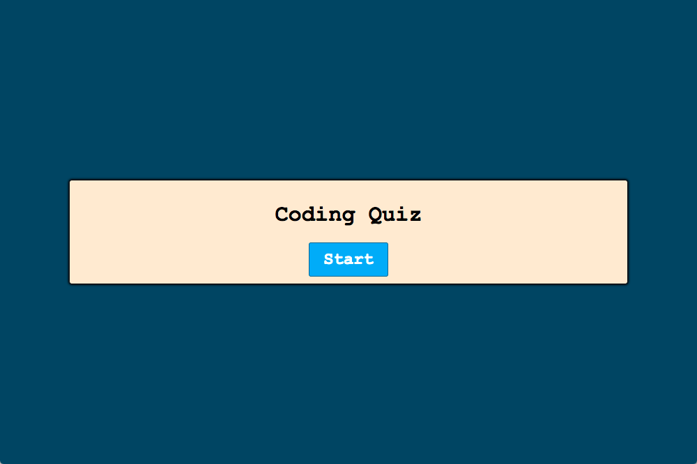
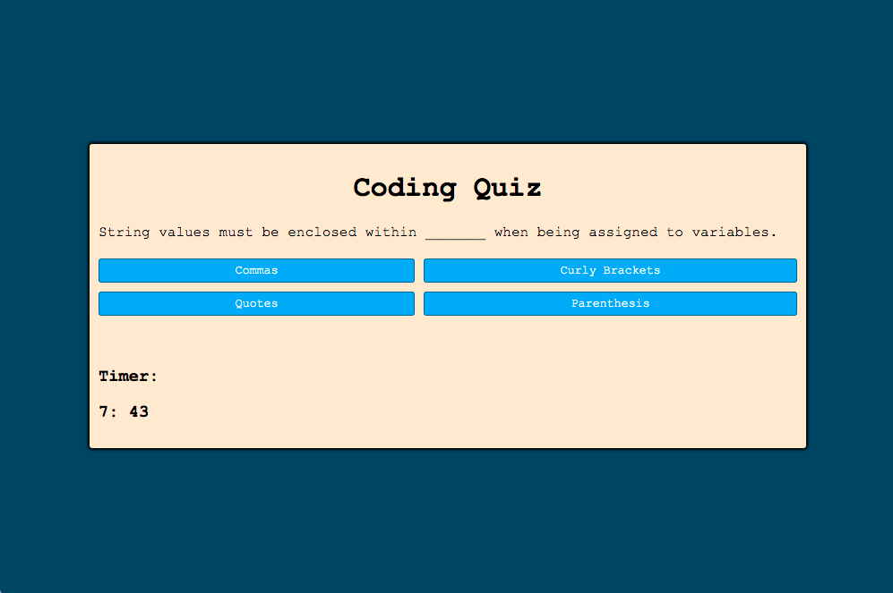

A refreshment on JavaScript, this challenge has helped smooth out a few rough edges I first had going into this. Although there are still many rough edges to be smoothed, this has greatly boosted my confidence in problem solving when it related to JavaScript. 

Even at a base-level of understanding, I feel this challenge gave me a big step in the right direction. 

They're a few requirements missing such as the clock taking off time for incorrect answers. I would like to add a text alert inside the container displaying "Correct!" or "Incorrect!" when questions are answered.

There is also no score keeper currently, but I would like to implement soon. 

I also used the questions displayed in the mock-up to save a little time. ツ

Deployed GitHub Page URL: https://yourfunkydad.github.io/Code-Quiz/

GitHub Repository: https://github.com/YourFunkyDad/Code-Quiz

